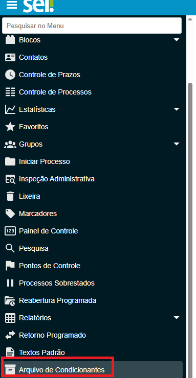

**RN006 - Contagem de Temporalidade: Menu Tabela de Condicionantes**
====================================================================

Como acessar o menu para o cadastro de Condicionantes no módulo GD?
-------------------------------------------------------------------
Para cadastrar a condicionante no Módulo de Gestão Documental, o usuário deve utilizar o menu 'Arquivo de Condicionante' apresentado abaixo:

