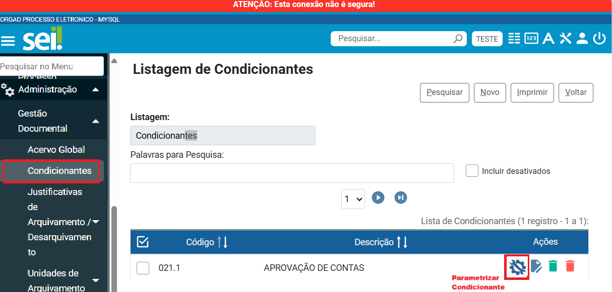

**RN009 - Contagem de Temporalidade: Listagem de Condicionante**
================================================================

Como acessar o ícone 'Cadastrar Condicionante' por meio do menu no módulo GD?
-----------------------------------------------------------------------------

O usuário poderá clicar no ícone 'Cadastro de Condicionante' no Módulo de Gestão Documental, disponível na listagem de 
condicionante apresentada abaixo:

