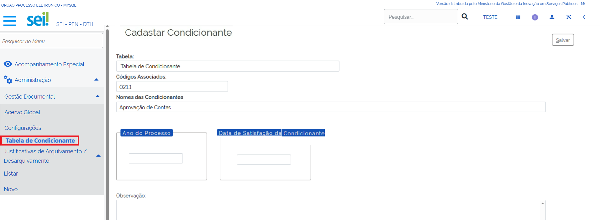

**RN010 - Contagem de Temporalidade: Cadastro de Condicionante**
================================================================

Como acessar o Cadastro de Condicionante por meio do menu no módulo GD?
-----------------------------------------------------------------------
Ao clicar no ícone 'Cadastro de Condicionante' no Módulo de Gestão Documental, o usuário deverá ser direcionado para a página 'Cadastro de Condicionante' apresentada abaixo:

