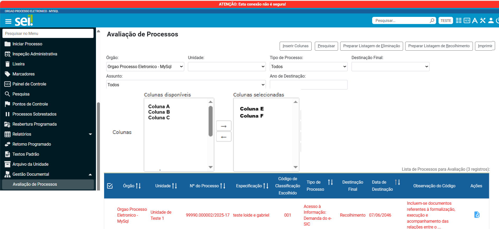

<<<<<<< HEAD
**RN012 - Avaliação: Parametrizar colunas a serem exibidas na tela de avaliação de processos
============================================================================================

Como parametrizar o número de colunas a serem exibidas na avaliação de processos?
---------------------------------------------------------------------------------

Notas
-----
Caso o usuário deseje escolher quais colunas visualizar na listagem de eliminação, o limite máximo de escolha/colunas a 
serem exibidas será 11 (onze) como ocorre atualmente.
=======
**RN012 - Contagem de Temporalidade: Identificação de Despesa**
===============================================================
DUVIDA A SER TIRADA COM EQUIPE TÉCNICA

Como o módulo identificará o ano em que houve a despesa para iniciar a contagem de temporalidade em guarda intermediária? (lembrando que o ano de criação do processo não necessariamente será o ano da despesa que necessita aprovação de contas)
>>>>>>> 790af019eb99f23c1a9a158e8532a48791aa4b96
