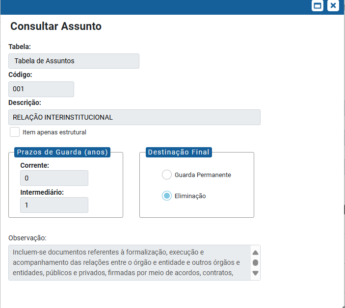

**RN016 - Arquivamento: Exibição de Campos no Arquivo da Unidade**
=================================================================

Como deve ser feita a exibição de campos na tela 'Arquivo da Unidade'?
----------------------------------------------------------------------

Campo **Assunto**
-----------------
No campo de seleção "**Assunto**" mostrar apenas o código de classificação (Ex: 019.01). 
A descrição do código deve ser mostrada ao passar o cursor do mouse.
Isso é necessário para otimizar o espaço em tela tendo em vista que há processos que tem diversos assuntos associados. 

Código de Classificação
-----------------------
Nas telas onde são apresentadas o "Código de Classificação" além de apresentar a descrição ao passar o cursor, o sistema deve permitir também que ao clicar seja apresentada uma janela com os dados do código de classificação (prazo corrente, prazo intermediário, destinação, etc.) 
O nome da janela deve ser "Consultar assunto", conforme imagem abaixo:

Notas
-----
Essa janela será a mesma apresentada quando, na tela de Consultar/Alterar Processo , se da um duplo clique no assunto do processo.
