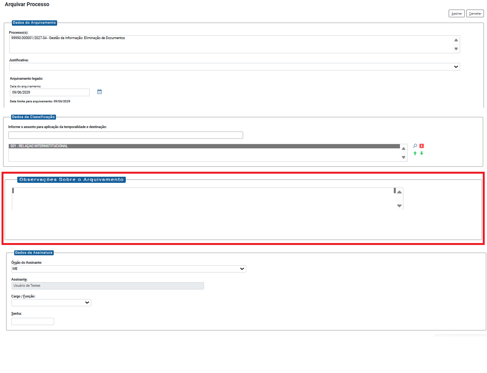
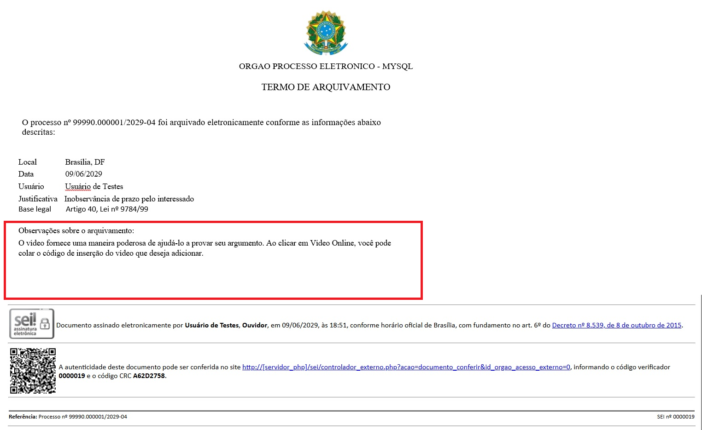

**RN021 - Arquivamento: Apresentar Mensagem de Arquivamento**
=============================================================

Como apresentar mensagem de arquivamento tanto na tela 'Arquivar ´Processo' quanto no Termo de Arquivamento?
------------------------------------------------------------------------------------------------------------

Na tela 'Arquivar Processo' deverá ser incluso um campo denominado "Observações Sobre o Arquivamento" para inserção de uma mensagem relacionada ao arquivamento, conforme apresentado abaixo:

Notas
-----
Essa mensagem deve constar no 'Termo de Arquivamento', como apresentado abaixo:

