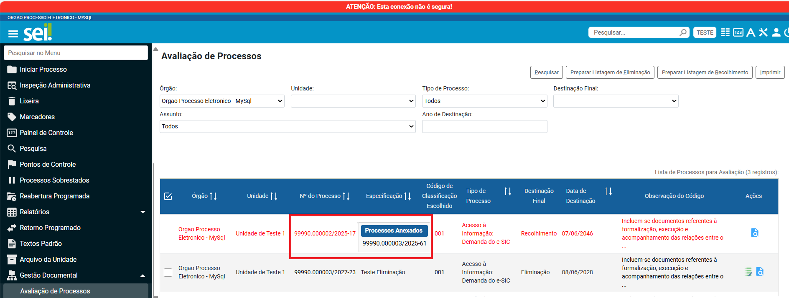

**RN022 - Avaliação: Indicar processos anexados na listagem de avaliação**
==========================================================================

Como informar ao usuário sobre os processos anexados na listagem de avaliação?
------------------------------------------------------------------------------

O usuário poderá visualizar os processos anexados à um registro listado ao posicionar o cursor sobre o número do proceso conforme
imagem abaixo: 

