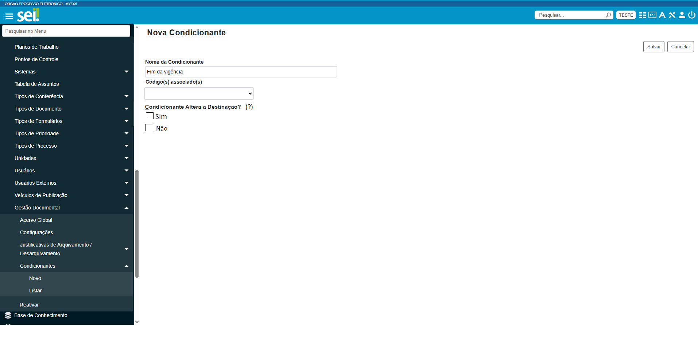

**RN028 - Condicionantes: Destinação da Condicionante**
=======================================================

Como saber que a destinação da condicionante será alterada?
-----------------------------------------------------------

Caso o campo 'Não' seja marcado a destinação será alterada para a destinação diversa. 

Se a destinação do assunto for eliminação o módulo deverá ignorar e enviar o processo para recolhimento e vice-versa.

     
