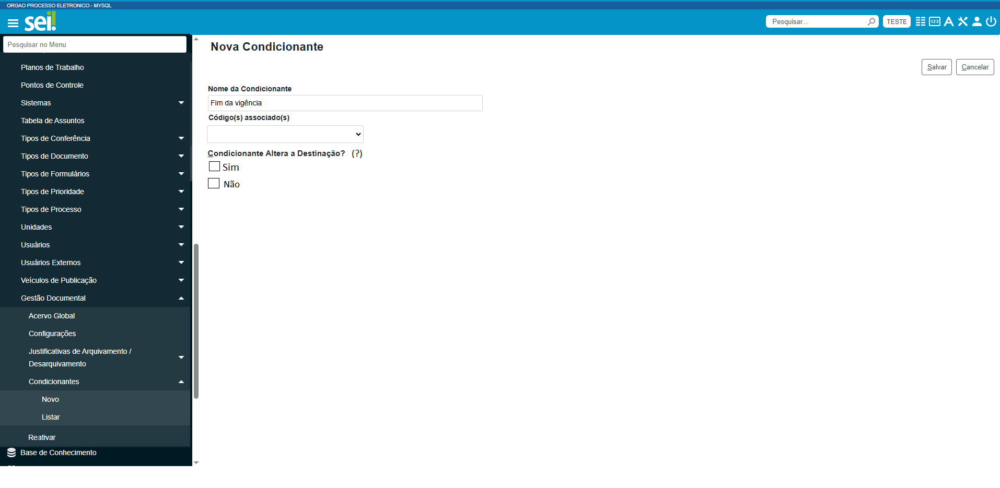

**RN028 - Condicionantes: Destinação da Condicionante**
=======================================================

Como saber que a destinação da condicionante poderá ser alterada?
-----------------------------------------------------------------

Caso o campo 'Sim' seja marcado, a destinação final poderá ser alterada. 

Caso o campo 'Não' seja marcado, a destinação final não será alterada. 

     
