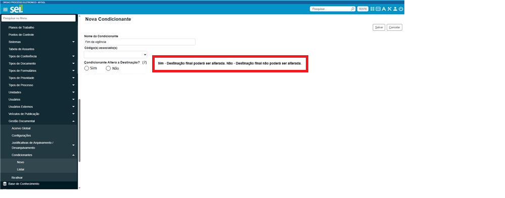

**RN029 - Condicionantes: Exibir tooltip informando dados sobre a condicionante**
=================================================================================

Como informar ao usuário que a destinação da condicionante poderá ser alterada?
-------------------------------------------------------------------------------

Ao passar o cursor do mouse sobre a informação "?", deverá ser exibido tooltip com a mensagem: 

' Sim - Destinação final poderá ser alterada. Não - Destinação final não poderá ser alterada.'

