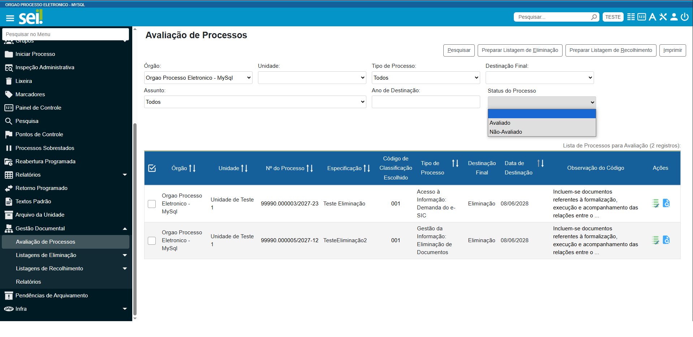

**RN032 - Avaliação: Novo filtro na tela de Avaliação de Processos**
====================================================================

Como devo distinguir os processos 'Avaliados' dos 'Não Avaliados'?
------------------------------------------------------------------

Conforme imagem abaixo, na tela de Avaliação de Processos deverá constar um filtro 'Status do Processo' para distinguir os processos 'Avaliados' dos 'Não Avaliados' durante a pesquisa.  

