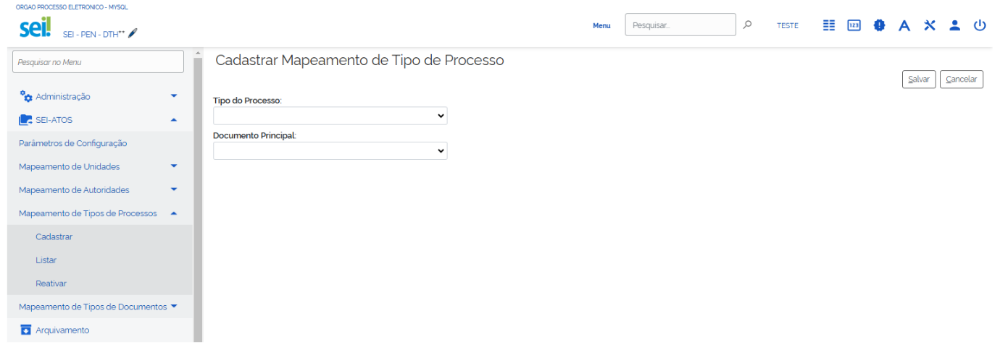

**RN 83**
=========
A página deve apresentar um layout adaptativo que se ajusta conforme a operação sendo realizada (Adicionar/Alterar). 

- Para Adicionar, a caixa de seleção de tipo de processo deve estar habilitada e a de documento principal desabilitada inicialmente. 

- Para Alterar, a caixa de tipo de processo deve estar desabilitada e preenchida, enquanto a de documento principal deve estar habilitada e preenchida. 

.. figure:: AdicionarTipoProcesso6.png

O layout deve seguir o padrão visual do sistema, com barra de comandos, área de dados e botões de ação claramente organizados.
