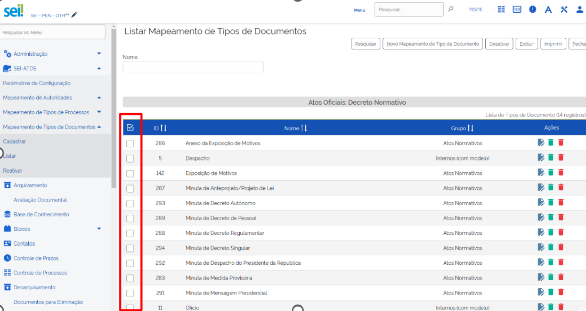

**RN 136**
==========
O sistema deve fornecer ações em lote para que os administradores possam realizar operações em múltiplos mapeamentos de uma vez. 

Deve ser possível selecionar vários registros e executar ações como desativação ou exclusão em todos eles de forma simultânea, exibindo confirmação da operação.

- **Exemplo de Tela:**

