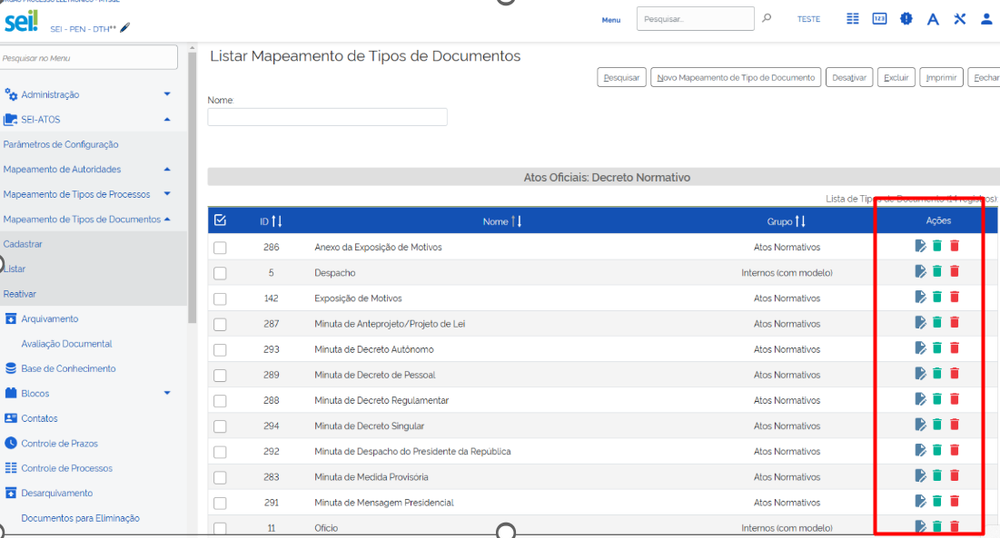

**RN 137**
==========
O sistema deve oferecer ações individuais para cada registro, permitindo alteração, desativação e exclusão unitárias. 

Essas ações devem ser acessíveis através de botões posicionados na última coluna da tabela, identificados por ícones significativos. Ao clicar na ação de alteração, o usuário deve ser direcionado para a página de edição do mapeamento. 

Ao clicar nas ações de exclusão ou desativação, deve ser exibida uma confirmação antes de efetivar a operação.

- **Exemplo de Tela:**

