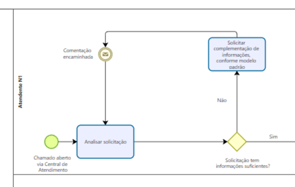

2023.05.29-Solicitar informações complementares-v1
==================================================

Situação  
~~~~~~~~

Este procedimento tem a finalidade de orientar o atendente sobre como solicitar maiores informações quando o chamado registrado estiver carente de dados importantes para a resolução.  

Quando Ocorre
~~~~~~~~~~~~~

O atendente se encontra em uma situação que precisaria de maiores informações ou dados mais precisos fornecidos para o suporte assertivo para o Usuário.

Solução sugerida  
~~~~~~~~~~~~~~~~

O atendente irá solicitar ao Usuário quais informações serão necessárias para resolução do chamado, tais como:  

**Relato de erro:**  

Uma descrição clara e concisa do que é o erro.  

**Como reproduzir?**  

Passos para reproduzir o comportamento:  

Exemplo:  

1. Vá para '...'  

2. Clique em '....'  

3. Role para baixo até '....'  

4. Veja o erro  

**Capturas de Tela**  

Se possível, adicione capturas de tela para ajudar a explicar seu problema.   

**Contextualização da Falha:**  

**Ambiente:** 

Ex: nome e endereço do sistema em que o erro foi identificado, incluindo especificação de produção, homologação, desenvolvimento etc.  

Em se tratando de um módulo do SEI, qual a versão do módulo?  

Ex.: 1.0.0 

**Versão do SEI:**  

Ex.: 3.1.x   

**Perfil do Usuário:**   

Ex.: colaborador, externo, coordenador, administrador etc.  

**Navegador Utilizado:**  

Ex.: Google Chrome, Safari...  

**Log de Erros:**  

Adicione, se disponível, o log de erros registrado pelo sistema. Verifique a possibilidade de incluir o log registrado pelo Navegador, através da aba “Console” em ferramentas de desenvolvimento, e o log registrado no servidor, através do Kibana (para usuários com perfil de TI). 

Modelo de Resposta para Chamados  
~~~~~~~~~~~~~~~~~~~~~~~~~~~~~~~~
 
Prezado (a) [inserir nome do Usuário],  

Bom dia/Boa tarde/Boa noite. 

Para atender a sua solicitação, são necessárias as seguintes informações:  

- [Inserir Informação 01];  

- [Inserir Informação 02];  

- [Inserir Informação 03];  

Dessa forma, a nossa equipe terá condições de atender devidamente o chamado.

Atenciosamente,  

Equipe PEN 

Atribuições e responsabilidades  
~~~~~~~~~~~~~~~~~~~~~~~~~~~~~~~~

Equipe de 1º Nível 

Perfil do usuário  
~~~~~~~~~~~~~~~~~~

N/A 

Palavras-chave  
~~~~~~~~~~~~~~~

Informação Faltante; Carência de informações; Informação não suficiente; Informação imprecisa 
 

Referências  
~~~~~~~~~~~~

N/A