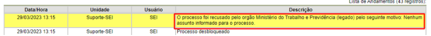
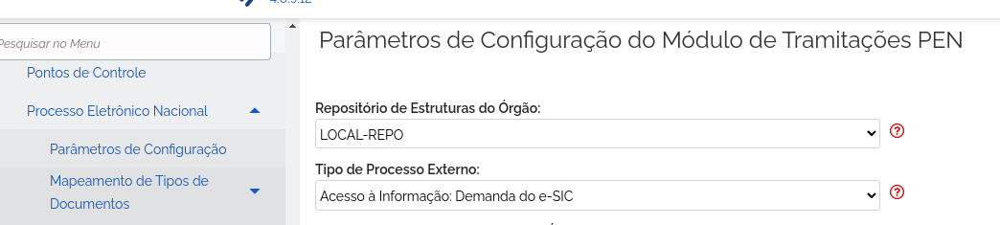
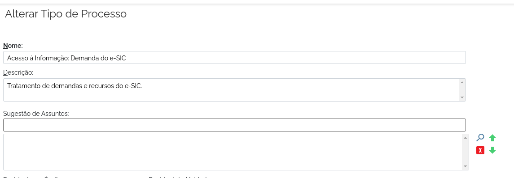
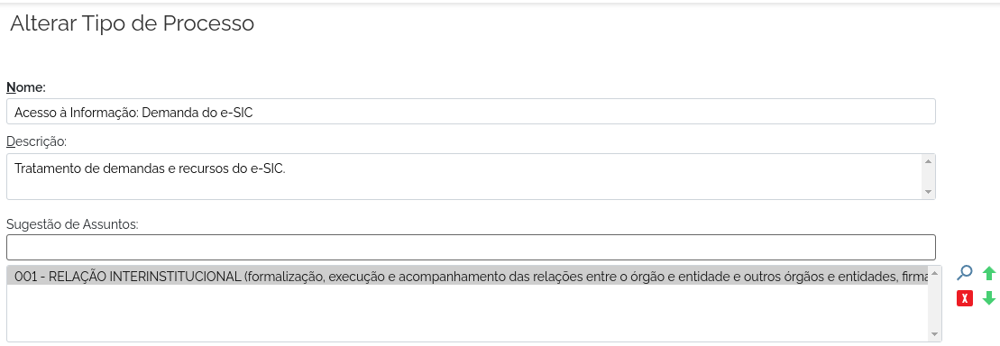

2023.05.08-Processos sendo recusados por motivo 99 - Nenhum assunto foi informado-V1
====================================================================================

Situação  
~~~~~~~~

Processos sendo recusados pelo destinatário com o motivo 99 - Nenhum assunto informado para o processo.
  

Quando Ocorre
~~~~~~~~~~~~~

Este caso pode ocorrer da seguinte forma:
 
O sistema REMETENTE utilizar um Tipo de Processo específico dele, por exemplo 'Ofício Especial Xyz' que não existe nos Tipos de Processo do Destinatário, neste caso o SEI/Super de Destino irá tentar utilizar o 'Tipo de Processo Externo' indicado na tela de Parâmetros de Configuração do Tramita GOV.BR:
 

Como no exemplo acima, caso o Tipo de Processo 'Acesso a informação...' não possua uma Sugestão de Assuntos associada como no exemplo abaixo:
  

Ao tentar receber um processo externo e utilizar este tipo externo configurado, a recusa por motivo 99 - 'Nenhum assunto informado para o processo' irá ocorrer.

Solução Sugerida  
~~~~~~~~~~~~~~~~

Alterar no cadastro do 'Tipo de Processo' que foi utilizado como o padrão na tela de Parâmetros de Configuração do módulo Tramita GOV.BR do DESTINATÁRIO, associando uma 'Sugestão de Assuntos' para que seja usada nestes casos de recebimento de tipo de processo diferentes dos existentes no destinatário conforme o exemplo abaixo:
 

Após este ajuste solicitar ao REMETENTE que efetue nova tentativa de tramitação.

Modelo de Resposta para Chamados  
~~~~~~~~~~~~~~~~~~~~~~~~~~~~~~~~

(Indicar como o atendente deverá responder ao chamado, incluindo o texto de saudação inicial, o corpo da resposta e a despedida ou fecho. Exemplo aqui.)

Respostas em Construção.

Atribuições e responsabilidades  
~~~~~~~~~~~~~~~~~~~~~~~~~~~~~~~

*(Indicar quem é responsável pelo atendimento da demanda, se são os atendentes de 1º nível ou se o chamado deve ser encaminhado para outras instâncias)*  

Perfil do usuário  
~~~~~~~~~~~~~~~~~

*(Indicar se a demanda tem caráter negocial ou técnico. Se técnico, indicar o perfil do usuário no sistema)*

Palavras-chave  
~~~~~~~~~~~~~~

Tramita; motivo 99; Nenhum assunto informado.

Referências  
~~~~~~~~~~~

Material construído conforme o conteúdo abordado nos treinamentos/apresentações ocorridas nos dias `05/04/2023  <https://drive.google.com/file/d/1rZL24WiAyqzBCSKvElNc7y785VdUHxia/view>`_, `12/04/2023 <https://drive.google.com/file/d/1BxBIhO7YURqbae5LtGCQut9nQ2RF9Byz/view>`_ e `19/04/2023 <https://drive.google.com/file/d/1H4qfihC8DAcvDuOOodPi34TK2Q29XQ5E/view>`_.