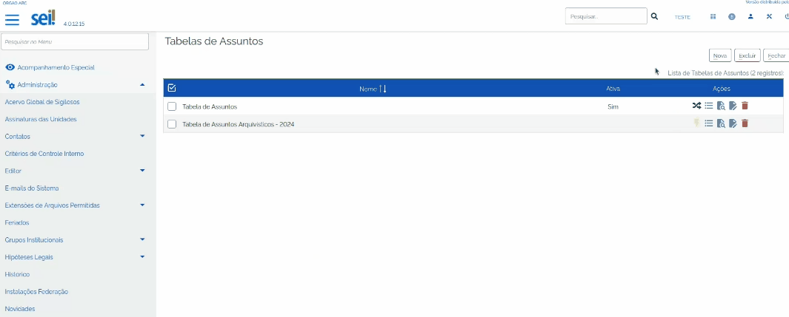

Documentação de Apoio
======================

FAQ
---
 
- `FAQ <https://www.gov.br/economia/pt-br/assuntos/processo-eletronico-nacional/destaques/faq/faq-sobre-o-sei>`_

Manuais de Usuários
--------------------

- `Metodologia de implantação <https://www.gov.br/economia/pt-br/assuntos/processo-eletronico-nacional/destaques/material-de-apoio-2/documentacao-sei/metodologia-de-implantacao/metodologia-de-implantacao>`_
- `Manual de Protocolo e Arquivo <https://softwarepublico.gov.br/social/sei/manuais/manual-do-protocolo-e-arquivo/sumario>`_
- `Manual de Publicação <https://softwarepublico.gov.br/social/sei/manuais/manual-de-publicacao/publicacao-2.5.1>`_
- `Manual do Usuário do SEI! <https://manuais.processoeletronico.gov.br/pt-br/latest/SEI/index.html>`_
- Manual do Administrador (em construção)

Manuais Técnicos
----------------

- `Exemplos Infraestrutura TI <https://softwarepublico.gov.br/social/sei/manuais/infraestrutura/sumario>`_
- `Manual de Instalação <https://softwarepublico.gov.br/social/sei/manuais/manuais-de-instalacao>`_
- `Configuração para Oracle <https://softwarepublico.gov.br/social/sei/manuais/manual-oracle/instalacao-oracle>`_
- `Manual de WebServices <http://processoeletronico.gov.br/images/documentacao/SEI-WebServices-v3.0.pdf>`_
- `Padrão de Codificação PHP <https://softwarepublico.gov.br/social/sei/manuais/padrao-de-codificacao-php/sumario>`_
- `Padrão de Modelagem de Dados  <https://softwarepublico.gov.br/social/sei/manuais/padrao-de-modelagem-de-dados/sumario>`_
- `Ambiente de Desenvolvimento - Vagrant  <https://softwarepublico.gov.br/social/sei/manuais/vagrant/sumario>`_
- Desenvolvimento Colaborativo e de Módulos
 
Apresentações Técnicas
------------------------

- `Tópicos sobre Implantação <https://www.gov.br/economia/pt-br/assuntos/processo-eletronico-nacional/servicos/treinamento_sei_implantar_20170323_vseges.pdf>`_
- `SLTI <https://www.gov.br/economia/pt-br/assuntos/processo-eletronico-nacional/servicos/pen_apresentacao_reuni_ot_cnicalslti_v2.pdf>`_
- `CADE <https://www.gov.br/economia/pt-br/assuntos/processo-eletronico-nacional/servicos/apresenta__o_informa__es_t_cnicas_do_sei-cade.pdf>`_

Módulo v3.1
-----------

- `Manual de Módulos - SEI 3.1 <https://www.gov.br/economia/pt-br/assuntos/processo-eletronico-nacional/arquivos/documentacao-do-sei/sei-modulos-v3-1.pdf>`_
- `Novidades - SEI 3.1 <https://www.gov.br/economia/pt-br/assuntos/processo-eletronico-nacional/arquivos/documentacao-do-sei/sei-novidades-v3-1.pdf>`_
- `Manual de Instalação - SEI 3.1  <https://www.gov.br/economia/pt-br/assuntos/processo-eletronico-nacional/arquivos/documentacao-do-sei/sei-instalacao-v3-1.pdf>`_
- `Manual de Publicação - SEI 3.1 <https://www.gov.br/economia/pt-br/assuntos/processo-eletronico-nacional/arquivos/documentacao-do-sei/sei-publicacao-v3-1.pdf>`_
- `Manual de Webservices - SEI 3.1 <https://www.gov.br/economia/pt-br/assuntos/processo-eletronico-nacional/arquivos/documentacao-do-sei/sei-webservices-v3-1.pdf>`_

Scripts de Conversão Tabela de Assuntos SEI
-------------------------------------------

Esta seção é dedicada à concentração dos scripts a serem utilizados para a conversão ("DE PARA") das tabelas de Assuntos utilizadas no SEI, conforme as portarias emitidades pelo Arquivo Nacional.

Sobre esse tema, algumas observações:

- Tais scripts deverão ser utilizados por servidores com perfil profissional técnico e acesso ao banco de dados SEI do seu Órgão/UNIDADE.

- Esta solução só poderá ser utilizada em versões superiores a 4.0;

- Recomenda-se que os scripts sejam testados em ambiente de homologação antes de serem aplicados no ambiente de produção do SEI.

.. admonition:: Nota

   Para um funcionamento adequado da tabela 'De/Para', onde a relação é de 1 para 1, foram preenchidas as lacunas dos códigos da coluna 'De', repetindo-se o código original e adicionando as letras a,b,c... após o número. Isso se aplica aos códigos que foram desdobrados em mais de 1, na coluna 'Para'. Dessa forma, ressalta-se a necessidade de análise do órgão antes de qualquer aplicação no ambiente de produção.

   
Resolução 14 para portaria 174/24
+++++++++++++++++++++++++++++++++

1) Executar o script de mapeamento. Abaixo seguem os scripts de mapeamento por tipo de banco de dados utilizado;

:download:`Scrip_SQLServer <_static/images_downloads/script_mapeamento_Sqlserver_2.sql>`

:download:`Scrip_MySQL <_static/images_downloads/script_mapeamento_Mysql_3.sql>`

:download:`Scrip_Oracle <_static/images_downloads/script_mapeamento_Oracle_2.sql>`

.. admonition:: Nota

   O script de mapeamento irá realizar a inserção de uma nova tabela e seus assuntos arquivísticos, de acordo com a tabela da Portaria 174/24. Em seguida realizará a transferência dos assuntos finalísticos que o Órgão possui em sua tabela corrente para a nova tabela. Ao final do processo realizará o mapeamento dos assuntos da tabela corrente para a nova tabela, de acordo com a tabela de equivalência editada pelo Arquivo Nacional.

   A planilha de De/Para utilizada para conversão da resolução 14 para a portaria 174/24 está disponível no link a seguir: :download:`DePara_Res14_Por174 <_static/images_downloads/DePara_Res14_Por174.xlsx>`

2) Após o término da execução do script de relacionamento, uma nova tabela de assuntos ficará disponível no SEI;

3) Analisar o conteúdo da nova tabela de assuntos e ativá-la;

4) Para concluir o trabalho, executar o script de atualização das sequências do banco de dados SEI, se o banco de dados for o MySQL ou Sql Server. Para isso, execute o comando: 

:: 
  
  /usr/bin/php -c /etc/php.ini /opt/sei/scripts/atualizar_sequencias.php > atualizacao_versao_sei.log

