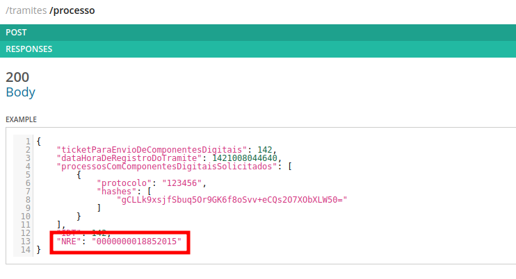
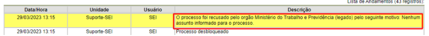

Tramita.GOV.BR
==============

O **Tramita.GOV.BR** (anteriormente, Barramento de Serviços do PEN) destina-se à tramitação de processos administrativos eletrônicos e documentos avulsos, em meio eletrônico, entre os diversos Sistemas de Processo Administrativo Eletrônico (SPE) existentes, com incrementos de segurança, integridade, agilidade e redução de custos no serviço público.

A adoção da plataforma se traduz em um significativo impacto em termos de agilidade e capilaridade da Administração Pública,  visto que o Tramita.GOV.BR possibilita a interoperabilidade entre os mais diversos sistemas utilizados pelos órgãos e entidades da Administração Pública.

Maiores informações sobre o **Tramita.GOV.BR** podem ser consultadas no `Portal do Processo Eletrônico Nacional <https://www.gov.br/economia/pt-br/assuntos/processo-eletronico-nacional/conteudo/tramita.gov.br>`_

Base de Conhecimento
++++++++++++++++++++

Documentação de Apoio
---------------------
 
- `FAQ <https://www.gov.br/economia/pt-br/assuntos/processo-eletronico-nacional/destaques/faq/FAQ%20do%20tramita-gov-.br/tramita-gov.br>`_

**Manuais**

- `Manual Operacional do Tramita.GOV.BR <https://www.gov.br/economia/pt-br/assuntos/processo-eletronico-nacional/arquivos/tramita-gov-br-documentos/Manual_Tecnico_Operacional_do_Tramita.GOV.BR.pdf>`_
-  `Manual de Instalação do Módulo Tramita.GOV.BR <https://github.com/spbgovbr/mod-sei-pen/blob/master/docs/INSTALL.md>`_
-  `Manual de Utilização da API - Parte 1 <https://www.gov.br/economia/pt-br/assuntos/processo-eletronico-nacional/destaques/material-de-apoio-2/tramita-gov.br/kit_desenvolvimento-zip.001>`_
-  `Manual de Utilização da API - Parte 2 <https://www.gov.br/economia/pt-br/assuntos/processo-eletronico-nacional/destaques/material-de-apoio-2/tramita-gov.br/kit_desenvolvimento.zip.002>`_
-  `Manual de Utilização da API - Parte 3 <https://www.gov.br/economia/pt-br/assuntos/processo-eletronico-nacional/destaques/material-de-apoio-2/tramita-gov.br/kit_desenvolvimento.zip.003>`_
-  `Manual de Utilização da API - Parte 4 <https://www.gov.br/economia/pt-br/assuntos/processo-eletronico-nacional/destaques/material-de-apoio-2/tramita-gov.br/kit_desenvolvimento.zip.004>`_
-  `Manual de Utilização da API - Parte 5 <https://www.gov.br/economia/pt-br/assuntos/processo-eletronico-nacional/destaques/material-de-apoio-2/tramita-gov.br/copy_of_kit_desenvolvimento.zip.005>`_
-  `Manual de Utilização da API - Parte 6 <https://www.gov.br/economia/pt-br/assuntos/processo-eletronico-nacional/destaques/material-de-apoio-2/tramita-gov.br/kit_desenvolvimento.zip.006>`_
-  `Manual de Utilização da API - Parte 7 <https://www.gov.br/economia/pt-br/assuntos/processo-eletronico-nacional/destaques/material-de-apoio-2/tramita-gov.br/kit_desenvolvimento.zip.007>`_
-  `Tabela de Espécies Documentais <https://www.gov.br/economia/pt-br/assuntos/processo-eletronico-nacional/destaques/material-de-apoio-2/copy_of_especiesdocumentais.xls>`_
-  `Integração do SEI com o Tramita.GOV.BR - Parte 1 <https://drive.google.com/file/d/1vkwGTxbiSPZ2w-AoACg2Ab2YBZnVr9xw/view?usp=sharing>`_
-  `Integração do SEI com o Tramita.GOV.BR - Parte 2 <https://drive.google.com/file/d/1Yb9ughH4wNy34zKGUuZNBHaSUlWG5W4e/view?usp=sharing>`_
-  `Swagger - Homologação <https://homolog.api.processoeletronico.gov.br/swagger/swagger-ui/>`_
-  `Swagger - Produção <https://api.conectagov.processoeletronico.gov.br/swagger/swagger-ui/>`_

**Vídeos**

-  `Vídeo expositivo sobre o projeto Barramento (Antigo nome do TRAMITA.GOV.BR) <https://www.youtube.com/watch?v=eXVAerj6LHc&t=754s>`_

 
Treinamentos/Apresentações
-------------------------- 

+-------------+-------------------+----------------------+--------------------------------------------------------------------------------------------------+
|Realizado em |    Responsável    | Assuntos Tratados    |                Link                                                                              |
+=============+===================+======================+==================================================================================================+
| 05/04/2023  |- Vinícius Mendonça| - Conceito           |                                                                                                  |
|             |                   | - Histórico          | `Treinamento Parte 1 <https://drive.google.com/file/d/1rZL24WiAyqzBCSKvElNc7y785VdUHxia/view>`_  | 
|             |                   | - Status de trâmites |                                                                                                  |
|             |                   |                      |                                                                                                  |
+-------------+-------------------+----------------------+--------------------------------------------------------------------------------------------------+
| 12/04/2023  |- Vinícius Mendonça| - Módulo             |                                                                                                  |
|             |- Guilherme Cantoni| - API                | `Treinamento Parte 2 <https://drive.google.com/file/d/1BxBIhO7YURqbae5LtGCQut9nQ2RF9Byz/view>`_  | 
|             |                   | - Portal             |                                                                                                  |
|             |                   | - Simulação          |                                                                                                  |
+-------------+-------------------+----------------------+--------------------------------------------------------------------------------------------------+
| 19/04/2023  |- Vinícius Mendonça|- Portal Administração|                                                                                                  |
|             |                   |- Análise de Cenários |  Treinamento Parte 3                                                                             | 
|             |                   |                      |                                                                                                  |
|             |                   |                      |                                                                                                  |
+-------------+-------------------+----------------------+--------------------------------------------------------------------------------------------------+

 
Scripts de Atendimento
----------------------

Processo recusado por erro "Número do Processo NUP já se encontra cadastrado"  
~~~~~~~~~~~~~~~~~~~~~~~~~~~~~~~~~~~~~~~~~~~~~~~~~~~~~~~~~~~~~~~~~~~~~~~~~~~~~~
  

Situação  
^^^^^^^^^ 

Problema identificado em órgão que estão implementando integração com o Tramita.gov.br. No caso em questão, problema identificado inicialmente ANEEL por falta de envio de NRE do trâmite original. 

Quando Ocorre
^^^^^^^^^^^^^^

(Descrição do passo a passo e condições que o usuário percorreu para chegar na situação) 

Solução Sugerida  
^^^^^^^^^^^^^^^^

O problema de recusa de processo devido à existência de um outro processo contendo o mesmo NUP normalmente ocorre em novas integrações devido a falta de envio do Número de Registro Eletrônico - NRE no cabeçalho da requisição de trâmite do processo.  

Este número é gerado automaticamente pelo Tramita.gov.br no momento que é realizado o primeiro trâmite para determinado processo. Este número deve ser armazenado, tanto pelo sistema de orientem como o de destino, para que o mesmo possa ser rastreado pelo Tramita.gov.br e demais sistemas que irão receber o trâmite de processos. 

Considerando a API REST, esta informação deverá ser informada na seção cabeçalho nos metadados do processo, como exemplificado abaixo:  

.. figure:: _static/images/imagem_api_rest.png

O detalhamento do modelo de dados do cabeçalho está descrita na documentação dos serviços e pode ser acessada no `link <https://homolog.api.processoeletronico.gov.br/swagger/swagger-ui/#/tramite-service-v-3>`_ .

.. figure:: _static/images/imagem_detalhamento_modelo_dados.png

Conforme comentado, este número será gerado automaticamente no primeiro trâmite de determinado processo e é retornado como resposta ao serviço POST: /tramite/processo conforme apresentado abaixo:

O NRE deverá ser reenviado em todos os novos trâmites deste processo, indicando ao sistema destinatário que não se trata de um novo processo, mas sim, a devolução de um processo existente.

Para maiores informações sobre o modelo de dados a ser utilizado nos serviços do Tramita.gov.br, acesso o `link <https://homolog.api.processoeletronico.gov.br/swagger/swagger-ui/#/tramite-service-v-3>`_ .

  
Atribuições e responsabilidades  
^^^^^^^^^^^^^^^^^^^^^^^^^^^^^^^^

*(Indicar quem é responsável pelo atendimento da demanda, se são os atendentes de 1º nível ou se o chamado deve ser encaminhado para outras instâncias)*  

Perfil do usuário  
^^^^^^^^^^^^^^^^^^

*(Indicar se a demanda tem caráter negocial ou técnico. Se técnico, indicar o perfil do usuário no sistema)*

Palavras-chave  
^^^^^^^^^^^^^^

API REST; NRE; Número de Registro Eletrônico; recusa de processo; TRAMITA.GOV.BR.

Referências  
^^^^^^^^^^^

*(Indicar o material consultado – como FAQ, manuais ou portais – bem como a relação desse tema com outros scripts existentes. Utilizar preferencialmente links)*

 
 
Processos sendo recusados por motivo 99 - Nenhum assunto foi informado
~~~~~~~~~~~~~~~~~~~~~~~~~~~~~~~~~~~~~~~~~~~~~~~~~~~~~~~~~~~~~~~~~~~~~~

Situação  
^^^^^^^^^ 

Processos sendo recusados pelo destinatário com o motivo 99 - Nenhum assunto informado para o processo.
  

Quando Ocorre
^^^^^^^^^^^^^^

Este caso pode ocorrer da seguinte forma:
 
O sistema REMETENTE utilizar um Tipo de Processo específico dele, por exemplo 'Ofício Especial Xyz' que não existe nos Tipos de Processo do Destinatário, neste caso o SEI/Super de Destino irá tentar utilizar o 'Tipo de Processo Externo' indicado na tela de Parâmetros de Configuração do PEN:
 

.. figure:: _static/images/tela_parametros_configuracao.png

Como no exemplo acima, caso o Tipo de Processo 'Acesso a informação...' não possua uma Sugestão de Assuntos associada como no exemplo abaixo:
  
.. figure:: _static/images/Tela_alterar_tipo_processo.png

Ao tentar receber um processo externo e utilizar este tipo externo configurado, a recusa por motivo 99 - 'Nenhum assunto informado para o processo' irá ocorrer.

Solução Sugerida  
^^^^^^^^^^^^^^^^

Alterar no cadastro do 'Tipo de Processo' que foi utilizado como o padrão na tela de Parâmetros de Configuração do módulo PEN do DESTINATÁRIO, associando uma 'Sugestão de Assuntos' para que seja usada nestes casos de recebimento de tipo de processo diferentes dos existentes no destinatário conforme o exemplo abaixo:
 
.. figure:: _static/images/Tela_alterar_tipo_processo_solucao.png

Após este ajuste solicitar ao REMETENTE que efetue nova tentativa de tramitação.

Atribuições e responsabilidades  
^^^^^^^^^^^^^^^^^^^^^^^^^^^^^^^^

*(Indicar quem é responsável pelo atendimento da demanda, se são os atendentes de 1º nível ou se o chamado deve ser encaminhado para outras instâncias)*  

Perfil do usuário  
^^^^^^^^^^^^^^^^^^

*(Indicar se a demanda tem caráter negocial ou técnico. Se técnico, indicar o perfil do usuário no sistema)*

Palavras-chave  
^^^^^^^^^^^^^^

Tramita; motivo 99; Nenhum assunto informado.

Referências  
^^^^^^^^^^^

*(Indicar o material consultado – como FAQ, manuais ou portais – bem como a relação desse tema com outros scripts existentes. Utilizar preferencialmente links)*

Processo recusado devido a existência de documento em formato X não permitido
~~~~~~~~~~~~~~~~~~~~~~~~~~~~~~~~~~~~~~~~~~~~~~~~~~~~~~~~~~~~~~~~~~~~~~~~~~~~~~

Situação  
^^^^^^^^^ 

Processo recusado devido a existência de documento em formato X não permitido.

Quando Ocorre
^^^^^^^^^^^^^^

Descrição informada pelo usuário: Os seguintes processos foram recusados pelo órgão “XXX” pelo seguinte motivo: Processo recusado devido a existência de documento em formato “XYZ” não permitido pelo sistema.

Solução Sugerida  
^^^^^^^^^^^^^^^^

O problema relatado consiste no conflito de regras de configuração entre os sistemas de processo eletrônico das instituições de origem e de destino do trâmite. Este conflito leva à recusa pelo sistema de destino, o que faz com que o Tramita.gov.br apenas informe a recusa o trâmite, reportando o motivo para o órgão de origem.
 
Não se trata de um erro, mas sim de um conflito de regras de uso dos sistemas nos órgãos. Neste caso, o gestor do sistema do órgão de origem deve buscar fazer contato com o gestor do sistema de destino, para verificar a possibilidade de incluir na lista de formatos de arquivos permitidos no sistema o formato que desencadeou a mensagem de recusa. 
As possíveis soluções são:

1) A liberação, no sistema de destino, do formato de documento que desencadeou a recusa; ou 
2) A substituição, no sistema de origem, do arquivo no formato recusado por outro arquivo, de idêntico teor, mas salvo em formato aceito pelo órgão de destino.
Alternativamente, não sendo possível efetuar as alterações acima citadas, deve ser utilizado mecanismo alternativo de remessa do processo recusado.

Atribuições e responsabilidades  
^^^^^^^^^^^^^^^^^^^^^^^^^^^^^^^^

*(Indicar quem é responsável pelo atendimento da demanda, se são os atendentes de 1º nível ou se o chamado deve ser encaminhado para outras instâncias)*  

Perfil do usuário  
^^^^^^^^^^^^^^^^^^

*(Indicar se a demanda tem caráter negocial ou técnico. Se técnico, indicar o perfil do usuário no sistema)*

Palavras-chave  
^^^^^^^^^^^^^^

Tramita; documento; formato não permitido.

Referências  
^^^^^^^^^^^

*(Indicar o material consultado – como FAQ, manuais ou portais – bem como a relação desse tema com outros scripts existentes. Utilizar preferencialmente links)*

ERRO DE PROCESSOS TRAVADOS NO STATUS 4- Arquivos digitais recebidos pelo destinatário NO PAINEL DO TRAMITA
~~~~~~~~~~~~~~~~~~~~~~~~~~~~~~~~~~~~~~~~~~~~~~~~~~~~~~~~~~~~~~~~~~~~~~~~~~~~~~~~~~~~~~~~~~~~~~~~~~~~~~~~~~

Situação  
^^^^^^^^^ 

ERRO DE PROCESSOS TRAVADOS NO STATUS 4- Arquivos digitais recebidos pelo destinatário NO PAINEL DO TRAMITA.

Quando Ocorre
^^^^^^^^^^^^^^

O processo aparece no portal do Tramita travado indefinidamente com o status “4 - Arquivos digitais recebidos pelo destinatário”, porém, no SEI de origem, ainda continua bloqueado, informando estar “em Tramitação externa”.

A causa mais provável para estes casos é que os componentes digitais deste processo não estão mais disponíveis no disco temporário do Tramita.

O Tramita possui rotinas de expurgo destes arquivos que ficam temporariamente no disco até que o destinatário requisite e baixe eles para o destino final do trâmite. 

- Remetente envia processo
- Remetente envia componentes (pdf e outros documento)
- Tramita recebe metadados
- Tramita recebe e salva os componentes no disco temporariamente
- Destinatário pede ao tramita os metadados
- Destinatário pede ao tramita os documentos (o erro pode ocorrer neste ponto)

Solução Sugerida  
^^^^^^^^^^^^^^^^

Uma vez que o Processo se encontra travado por muito tempo em status 4 conforme o exemplo abaixo:

Como cancelado no Portal, mas não foi desbloqueado automaticamente, o usuário no órgão remetente pode clicar no botão “Cancelar Trâmite Externo” (vide captura abaixo). Isso forçará o sistema no órgão remetente a consultar novamente o status do trâmite, o que resultará no desbloqueio do processo.
Reparem que o botão de ‘Cancelar’ pode ser acionado por usuário gestor do órgão com acesso ao Painel do Tramita.

.. figure:: _static/images/tela_ultimos_tramites.png

Investigação interna de causa raiz:

É possível tentar visualizar a causa raiz efetuando consulta pelo IDT no registro de `logs do tramita <https://logs.processoeletronico.gov.br>`_ , menu Discover e busca pelo IDT, como no exemplo abaixo:

message:

[2m2023-04-13 13:03:20.359[0;39m [32m INFO[0;39m [35m10[0;39m [2m---[0;39m [2m[io-8081-exec-10][0;39m [36mb.g.m.p.b.a.s.w.v.e.TramiteEndpointV3 [0;39m [2m:[0;39m sistema : Fundação Nacional do Índio recusarTramite: parametros = RecusaDeTramite [idt=728778, justificativa=Descrição: SoapFault exception: [SOAP-ENV:Server] Arquivo bináriocom hash, \'OWwNy3nSII2gJqpBX8vRAhuk6VFypJgm1ghZG/qWMHU=\', não está mais disponí­vel, por favor contacte o sistema remetente. in /opt/sei/web/modulos/pen/rn/ProcessoEletronicoRN.php:1215 Stack trace: #0 /opt/sei/web/modulos/pen/rn/ProcessoEletronicoRN.php(1215): SoapClient->__call(\'receberComponen...\', Array) #1

Isto pode ocorrer por exemplo por conta da rotina de expurgo do tramita, o destinatário demorou muitos dias para tentar receber o tramite e neste momento o tramita já havia removido os componentes digitais que ficam temporariamente armazenados no tramita.

O cancelamento fica disponível tanto via painel do Tramita, quanto no Super/SEI do sistema Remetente.

.. figure:: _static/images/Tela_processo_botao_pen.png

.. admonition:: Importante 

   Se for cancelado via Painel do Tramita, é necessário clicar no ‘Cancelar tramite’ também no SEI/Super remetente pra liberar novamente uma nova tentativa de tramitação, portanto a melhor sugestão é sugerir que o remetente faça o cancelamento via SEI/Super e faça uma nova tentativa de tramite de algum destes processos que esteja nesta condição para verificar se o procedimento é suficiente para a solução do problema, não sendo suficiente nova investigação de logs do tramita se fará necessária.

Atribuições e responsabilidades  
^^^^^^^^^^^^^^^^^^^^^^^^^^^^^^^^

*(Indicar quem é responsável pelo atendimento da demanda, se são os atendentes de 1º nível ou se o chamado deve ser encaminhado para outras instâncias)*  

Perfil do usuário  
^^^^^^^^^^^^^^^^^^

*(Indicar se a demanda tem caráter negocial ou técnico. Se técnico, indicar o perfil do usuário no sistema)*

Palavras-chave  
^^^^^^^^^^^^^^

Tramita; STATUS 4; bloqueado; “em Tramitação externa”.

Referências  
^^^^^^^^^^^

*(Indicar o material consultado – como FAQ, manuais ou portais – bem como a relação desse tema com outros scripts existentes. Utilizar preferencialmente links)*

ERRO DE STATUS “CANCELADO” NO ENVIO DE PROCESSO
~~~~~~~~~~~~~~~~~~~~~~~~~~~~~~~~~~~~~~~~~~~~~~~~

Situação  
^^^^^^^^^

ERRO DE STATUS “CANCELADO” NO ENVIO DE PROCESSO

Quando Ocorre
^^^^^^^^^^^^^^

O processo aparece no portal do Tramita com o status “cancelado”, porém, no SEI de origem, ainda continua bloqueado, informando estar “em Tramitação externa”. 

Solução Sugerida
^^^^^^^^^^^^^^^^

Uma vez que o Processo se encontra como cancelado no Portal, mas não foi desbloqueado automaticamente, o usuário no órgão remetente pode clicar no botão “Cancelar Trâmite Externo” (vide captura abaixo). Isso forçará o sistema no órgão remetente a consultar novamente o status do trâmite, o que resultará no desbloqueio do processo.

 
.. figure:: _static/images/Tela_processo_botao_pen.png

Atribuições e responsabilidades  
^^^^^^^^^^^^^^^^^^^^^^^^^^^^^^^^

*(Indicar quem é responsável pelo atendimento da demanda, se são os atendentes de 1º nível ou se o chamado deve ser encaminhado para outras instâncias)*  

Perfil do usuário  
^^^^^^^^^^^^^^^^^^

*(Indicar se a demanda tem caráter negocial ou técnico. Se técnico, indicar o perfil do usuário no sistema)*

Palavras-chave  
^^^^^^^^^^^^^^

Tramita; Status Cancelado.

Referências  
^^^^^^^^^^^

*(Indicar o material consultado – como FAQ, manuais ou portais – bem como a relação desse tema com outros scripts existentes. Utilizar preferencialmente links)*

Falha de comunicação com o Processo Eletrônico Nacional. Por favor, tente novamente mais tarde
~~~~~~~~~~~~~~~~~~~~~~~~~~~~~~~~~~~~~~~~~~~~~~~~~~~~~~~~~~~~~~~~~~~~~~~~~~~~~~~~~~~~~~~~~~~~~~

Situação  
^^^^^^^^^

Falha de comunicação com o Processo Eletrônico Nacional. Por favor, tente novamente mais tarde

Quando Ocorre
^^^^^^^^^^^^^^

Quando um usuário tenta remeter um processo pelo Tramita.GOV.BR, o sistema não permite o trâmite e exibe a mensagem: “Falha de comunicação com o Processo Eletrônico Nacional. Por favor, tente novamente mais tarde.”

Esta falha ocorre quando o módulo não consegue estabelecer conexão com os serviços do Tramita.gov.br e pode se dar pelos seguintes motivos:

1) O certificado digital utilizado para autenticação nos serviços do Tramita.GOV.BR encontra-se inválido;
2) Os servidores de aplicação do SEI não confiam no Certificado Digital utilizado na criptografia do protocolo HTTPS do Tramita.GOV.BR; 
3) As regras de firewall impedem o acesso do SEI aos serviços do Tramita.GOV.BR; ou
4) Está ocorrendo uma indisponibilidade momentânea da Infraestrutura do Tramita.GOV.BR.

Solução Sugerida
^^^^^^^^^^^^^^^^

1. O certificado digital utilizado para autenticação nos serviços do Tramita.GOV.BR encontra-se inválido:

Neste caso, o gestor de protocolo do órgão deverá acessar o Portal de Administração do Tramita.GOV.BR e gerar um novo certificado digital para o sistema.

- `Homologação <https://homolog.gestaopen.processoeletronico.gov.br>`_

- `Produção <https://gestaopen.processoeletronico.gov.br>`_

Maiores informações acerca deste procedimento podem ser encontradas no `FAQ do Tramita.GOV.BR <https://www.gov.br/economia/pt-br/assuntos/processo-eletronico-nacional/destaques/faq/FAQ%20do%20tramita-gov-.br/tramita-gov.br>`_

2. Os servidores de aplicação do SEI não confiam no Certificado Digital utilizado na criptografia do protocolo HTTPS do Tramita.GOV.BR: 

A partir da versão 3.2.2 do módulo de integração do SEI com o Tramita.GOV.BR (mod-sei-pen), o módulo passou a forçar a validação da confiabilidade do certificado digital utilizado pela API do Tramita.GOV.BR. Desta forma, caso o servidor do SEI não confie no certificado utilizado pelo Tramita.GOV.BR (Let's Encrypt), irá ser apresentado o erro em questão. 

Para resolver o problema, a equipe de operações deverá atualizar os servidores do SEI para confiar nos certificados Let's Encrypt utilizados pela API de serviços. 

Os procedimentos para atualização dependem da distribuição do Linux que está sendo utilizada. Para maiores informações, acesse a documentação da distribuição utilizada.

Exemplo Ubuntu:

# sudo apt-get update
# apt-get install ca-certificates
# update-ca-certificates

Maiores informações sobre atualização da confiabilidade dos certificados podem ser encontradas no `link <https://letsencrypt.org/certificates/>`_

Outras informações sobre a expiração dos certificados Let's Encrypt podem ser vistas no `link <https://letsencrypt.org/docs/dst-root-ca-x3-expiration-september-2021/>`_

3. As regras de firewall impedem o acesso do SEI aos serviços do Tramita.GOV.BR:

Neste caso, a equipe de infraestrutura da instituição deverá ser consultada para revisar as regras de firewall e identificar se as requisições enviadas para os endereços abaixo estão sendo bloqueados:

- `Homologação <https://homolog.api.processoeletronico.gov.br/interoperabilidade/soap/v3/>`_

- `Produção <https://api.conectagov.processoeletronico.gov.br/interoperabilidade/soap/v3/>`_

Atribuições e responsabilidades  
^^^^^^^^^^^^^^^^^^^^^^^^^^^^^^^^

*(Indicar quem é responsável pelo atendimento da demanda, se são os atendentes de 1º nível ou se o chamado deve ser encaminhado para outras instâncias)*  

Perfil do usuário  
^^^^^^^^^^^^^^^^^^

*(Indicar se a demanda tem caráter negocial ou técnico. Se técnico, indicar o perfil do usuário no sistema)*

Palavras-chave  
^^^^^^^^^^^^^^

Tramita; falha de comunicação.

Referências  
^^^^^^^^^^^

*(Indicar o material consultado – como FAQ, manuais ou portais – bem como a relação desse tema com outros scripts existentes. Utilizar preferencialmente links)*

Acesso negado a este recurso nesta unidade
~~~~~~~~~~~~~~~~~~~~~~~~~~~~~~~~~~~~~~~~~~~

Situação  
^^^^^^^^^

Acesso negado a este recurso nesta unidade

Quando Ocorre
^^^^^^^^^^^^^^

Quando um usuário do SEI tenta realizar uma determinada operação, ele recebe a seguinte mensagem na tela: “Acesso negado a este recurso nesta unidade (exemplo_recurso / SIGLA-DA-UNIDADE).”

Solução Sugerida
^^^^^^^^^^^^^^^^

Normalmente, o erro "Acesso negado a este recurso nesta unidade" ocorre quando determinada funcionalidade acessada não está liberada para acesso devido a configuração do Perfil do Usuário.
Para solucionar o problema, os seguintes passos deverão ser realizados:

1) Identificar qual os Perfis utilizados pelo usuário que relatou o problema. Isto pode ser visto através de uma consulta no SIP (Menu: Permissão > Administradas).

2) O Administrador do sistema deverá acessar o SIP (Menu: Perfil > Montar) e adicionar o recurso mencionado no erro ao perfil vinculado ao usuário (ex.: Básico, Colaborador, Administrador etc.).

Para mais detalhes sobre a gestão de perfis e recursos, verifique o `Módulo 3 - Unidade 3 do curso SEI!Administrar <https://repositorio.enap.gov.br/bitstream/1/4990/3/M%C3%B3dulo%203%20-%20Controle%20de%20Acesso%20.pdf#page=14>`_

Atribuições e responsabilidades  
^^^^^^^^^^^^^^^^^^^^^^^^^^^^^^^^

*(Indicar quem é responsável pelo atendimento da demanda, se são os atendentes de 1º nível ou se o chamado deve ser encaminhado para outras instâncias)*  

Perfil do usuário  
^^^^^^^^^^^^^^^^^^

*(Indicar se a demanda tem caráter negocial ou técnico. Se técnico, indicar o perfil do usuário no sistema)*

Palavras-chave  
^^^^^^^^^^^^^^

Tramita; acesso negado.

Referências  
^^^^^^^^^^^

*(Indicar o material consultado – como FAQ, manuais ou portais – bem como a relação desse tema com outros scripts existentes. Utilizar preferencialmente links)*

