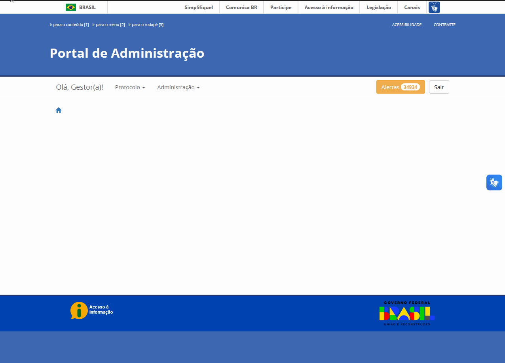

Conceitos Gerais
================

O que são Órgãos Públicos ou Entidades?
++++++++++++++++++++++++++++++++++++++++

**Órgãos** são unidades integrantes da estrutura da administração pública direta e indireta. Os **órgãos** podem ser integrantes de ambas as estruturas, enquanto as **entidades** pertencem somente à administração indireta, sempre mantendo vínculo com algum órgão da administração direta, apenas para fins de coordenação e supervisão, sem existência de grau de subordinação. 

Nesse contexto, os órgãos e entidades se configuram como clientes da plataforma Tramita GOV.BR e, para fins de praticidade, o termo órgão representa de forma extensiva tanto **órgãos** quanto entidades, não gerando prejuízo algum ao conteúdo da informação disponibilizada. 

O que são órgãos pertencentes ao SISG?
++++++++++++++++++++++++++++++++++++++++++++

Os órgãos pertencentes ao **Sistema de Serviços Gerais (SISG)** são parte integrante de um sistema administrativo orgânico que engloba toda a administração pública federal direta, autárquica e fundacional, num esforço de coordenação das atividades de logística pública com vistas a maior eficiência. Tal sistema é responsável por centralizar algumas atividades de forma integrada, com o intuito de estabelecer uma coordenação eficiente, padronizada e transparente, visando a redução de custos operacionais para a administração.

O que é Sistema de Processo Administrativo Eletrônico (SPE)?
+++++++++++++++++++++++++++++++++++++++++++++++++++++++++++++

**Sistema de Processo Administrativo Eletrônico (SPE)** é o termo utilizado para se referir aos sistemas internos utilizados pelos órgãos no gerenciamento de processos administrativos no exercício de suas atividades administrativas. Por exemplo: O SEI, o SIPAC, o SUAP, o Sapiens-AGU etc. 

   Sistemas Integrados ao Tramita GOV.BR

O que é Número de Registro Eletrônico (NRE)?
++++++++++++++++++++++++++++++++++++++++++++

**O Número de Registro Eletrônico (NRE)** está relacionado ao Número Único de Protocolo (NUP) ou Número do Processo. O NRE corresponde a uma **numeração de identificação estática**, que permanece constante em meio a todos os trâmites processuais gerenciados por meio do Tramita GOV.BR. Ou seja, esta numeração não é alterada à medida que novos trâmites são realizados.

O que é Índice de Trâmite (IDT)?
+++++++++++++++++++++++++++++++++

O **Índice de Trâmite (IDT)** é uma **numeração única atribuída a cada trâmite** existente dentro da plataforma do Tramita GOV.BR. Essa numeração serve como um identificador do trâmite processual e não deve ser confundida com o Número de Registro Eletrônico (NRE). Para cada movimentação externa realizada, um novo IDT é gerado.  

Tomando como exemplo uma movimentação processual partindo do órgão A para o B (1º trâmite), seguida de uma devolutiva do órgão B para o A (2º trâmite), serão gerados dois IDTs: um referente ao *1º trâmite* e outro referente ao *2º trâmite*. Não há um limite de quantidade de IDTs que podem ser atribuídos a um mesmo processo, uma vez que este valor está relacionado somente à movimentação processual na plataforma e não ao processo ou documento em si. 

   Índice de Trâmite (IDT)

O que é Solução de Integração com o Tramita GOV.BR?
++++++++++++++++++++++++++++++++++++++++++++++++++++

A **Solução de Integração** consiste, como o próprio nome diz, em uma solução responsável por realizar a interoperabilidade entre diferentes tipos de SPE com o Tramita GOV.BR. Ou seja, possibilita a conexão entre o SPE utilizado pelos órgãos e a plataforma. Dentre suas funcionalidades básicas, é possível citar o envio ou recebimento de processos eletrônicos.

Um exemplo bastante usual a ser citado é o `Módulo de Integração do SEI ao Tramita GOV.BR (MOD-SEI-PEN) <https://github.com/pengovbr/mod-sei-pen>`_, que consiste na **Solução de Integração** do SEI com a plataforma. 

O que é Portal de Administração do Tramita GOV.BR?
++++++++++++++++++++++++++++++++++++++++++++++++++

O `Portal de Administração do Tramita GOV.BR <https://gestaopen.processoeletronico.gov.br/>`_ é o ambiente gerencial que concede aos Gestores de Protocolo acesso às configurações das unidades administrativas, habilitando-as tanto para envio quanto para recebimento de processos ou documentos eletrônicos, às definições das unidades centralizadoras, ao cadastro de novos gestores e ao monitoramento dos trâmites de processos, por meio do Painel de Controle.

O que é o Painel de Controle?
++++++++++++++++++++++++++++++

O **Painel de Controle** é uma funcionalidade interna do Portal de Administração, disponível aos Gestores de Protocolo, que possibilita o monitoramento dos trâmites realizados pelo SPE vinculado ao órgão. Por meio do Painel de Controle, é possível identificar se determinado processo foi cancelado, recebido ou recusado pelo destinatário e, em caso de recusa, identificar seu motivo.

O que é um Certificado Digital?
++++++++++++++++++++++++++++++++

**Certificados Digitais** são documentos eletrônicos que carregam consigo dados relevantes sobre a pessoa física ou jurídica que os portam. Em linhas gerais, servem como uma identidade virtual, cuja finalidade maior é conferir a autenticidade, de forma segura, das transações digitais realizadas.

O que são Gestores de Protocolo?
++++++++++++++++++++++++++++++++

**Gestores de Protocolo** são os usuários responsáveis pelo gerenciamento do seu órgão no Portal do Tramita, que definem quais serão os parâmetros de integração e estabelecem a relação direta entre o SPE e o Portal de Administração. Além disso, são responsáveis por configurar quais unidades deverão estar habilitadas a realizar o envio e/ou o recebimento de processos por meio da Plataforma.

O que são Gestores Tecnológicos?
+++++++++++++++++++++++++++++++++

**Gestores Tecnológicos** são órgãos responsáveis pela infraestrutura na qual o SPE está implantado. Atualmente, existem duas opções: Interno e *Dataprev*. 

Na opção Interno, o SPE é instalado na infraestrutura interna do próprio órgão.  

Em contraste, o SPE pode ser implementado em uma infraestrutura externa, que não pertence ao órgão em questão. Um exemplo disso é a *Dataprev*, uma empresa pública de tecnologia que oferece serviços de hospedagem de sistemas em nuvem nas modalidades IAAS (*Infrastructure as a Service*) e SAAS (*Software as a Service*).

O que é um Órgão em Implantação?
++++++++++++++++++++++++++++++++

O órgão é classificado com o status **em implantação** quando, após realizar a solicitação de acesso inicial ao ambiente de homologação do Portal de Administração do PEN, recebe autorização de acesso para iniciar os testes do Tramita GOV.BR. Esse status permanece até que todas as etapas dos testes obrigatórios em ambiente de produção sejam concluídas. 

O que é um Órgão Implantado?
+++++++++++++++++++++++++++++

O órgão é classificado com o status **implantado** após concluir, com sucesso, os testes de envio e recebimento de processos e documentos avulsos e os testes de recusa de trâmite em ambiente de produção. 

O que são Unidades Administrativas?
+++++++++++++++++++++++++++++++++++

As **Unidades Administrativas** são unidades da estrutura organizacional do órgão armazenada no Portal do Tramita GOV.BR, que se conectam ao SPE ativo nesse órgão para possibilitar o envio ou recebimento de processos por meio da plataforma.

No caso dos órgãos integrantes do SISG, as Unidades Administrativas são importadas automaticamente do Sistema de Informações Organizacionais do Governo Federal (SIORG). Há uma lista pública de unidades disponível no `Portal de Administração <https://gestaopen.processoeletronico.gov.br/>`_. 

Toda unidade marcada para recebimento na plataforma será apresentada na tela de seleção de unidade destinatária de um processo a ser remetido.

O que são Unidades Centralizadoras?
+++++++++++++++++++++++++++++++++++

**Unidades Centralizadoras** são unidades responsáveis pelo recebimento de todos os processos enviados para o órgão, destinadas a qualquer das unidades com vínculo ativo no Portal de Administração. A interesse do órgão, quando configuradas e habilitadas, essas unidades funcionam basicamente como uma unidade de protocolo, ou seja, todos os processos recebidos via plataforma tramitarão por essa unidade.

.. admonition:: Ilustrando

   Se uma unidade (x) é indicada como unidade centralizadora de várias outras (a, b, c...), quaisquer processos ou documentos avulsos remetidos para quaisquer dessas outras unidades (a, b, c...) serão recebidos pela unidade centralizadora (x).

Para mais detalhes sobre como configurar uma unidade como centralizadora, consulte o `Manual Operacional do Tramita GOV.BR <https://www.gov.br/gestao/pt-br/assuntos/processo-eletronico-nacional/arquivos/tramita-gov-br-documentos/Manual_Tecnico_Operacional_do_Tramita.GOV.BR.pdf>`_ (PDF).

O que são Repositórios de Estrutura?
+++++++++++++++++++++++++++++++++++++

**Repositórios de Estrutura** são agrupadores (identificadores) utilizados na organização das estruturas internas de órgãos elegíveis para integração ao Tramita GOV.BR, em todos os níveis hierárquicos.  É através destes repositórios que o organograma de cada instituição se torna visível dentro da plataforma, possibilitando ao gestor de protocolos uma melhor identificação da unidade administrativa de destino, por exemplo. 

No caso do Poder Executivo Federal, esta estrutura é mantida pelo Sistema de Informações Organizacionais do Governo Federal (SIORG) e é importada de forma automática para o Tramita GOV.BR. 

Os demais poderes e entes federativos, após autorização de acesso e vínculo do seu órgão a uma estrutura, podem cadastrar a estrutura dos seus órgãos por meio da funcionalidade “hierarquia” no Portal de Administração.

.. admonition:: Após realizar o login no portal é necessário acessar: 

   Gestão do Tramita  > Órgão  > Hierarquia

