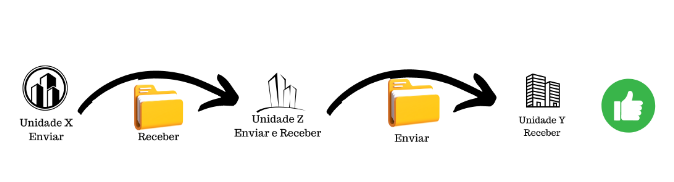
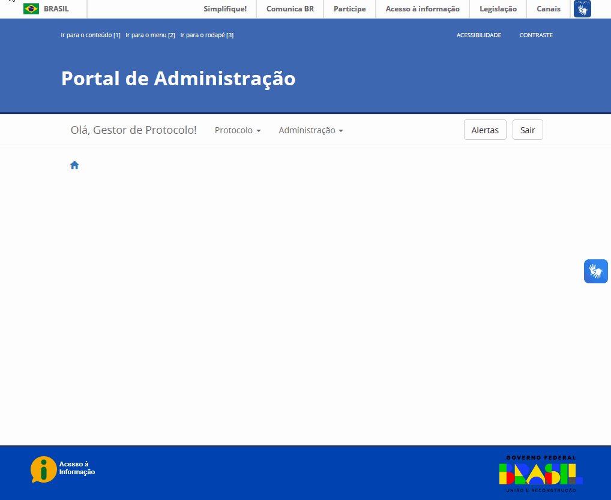
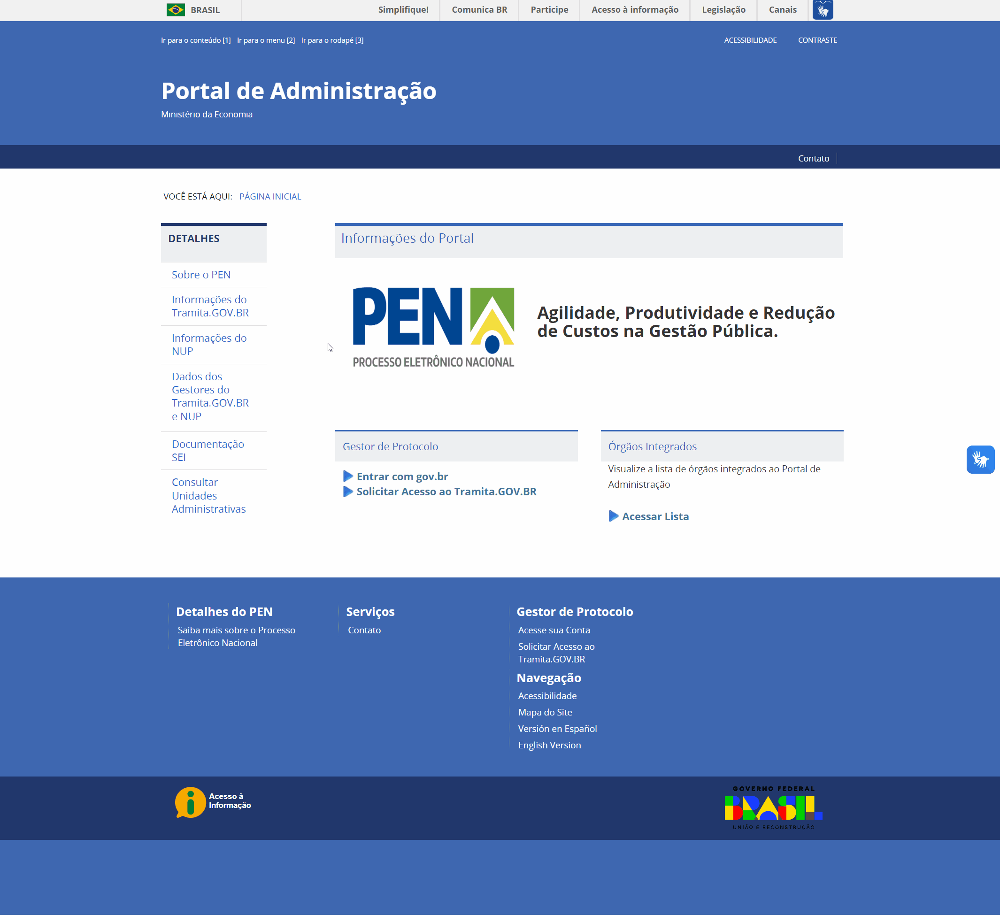
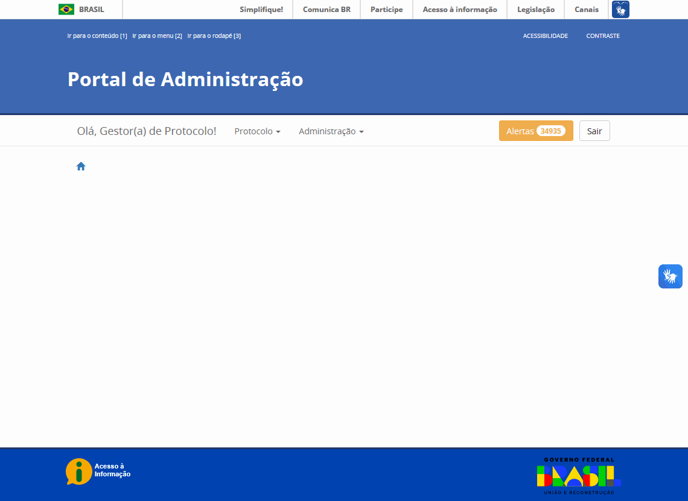

Utiliza Tramita Funcionalidades
================================

Como as Unidades Administrativas podem ser classificadas no Portal de Administração?
++++++++++++++++++++++++++++++++++++++++++++++++++++++++++++++++++++++++++++++++++++

As Unidades Administrativas **podem ser classificadas de três formas simples**, dentro do Portal de Administração. A classificação pode restringir unidades apenas para envio ou apenas para recebimento de processos, como também pode habilitar as duas funções para uma mesma unidade - envio e recebimento. 

**Enviar**

A unidade classificada apenas para envio de processos atua unicamente com essa finalidade. 

 

   A unidade classificada apenas para envio de processos atua unicamente com essa finalidade

**Receber**

A unidade classificada apenas para recebimento de processos atua unicamente com essa finalidade.

   A unidade classificada apenas para recebimento de processos atua unicamente com essa finalidade

**Enviar e Receber**

A unidade classificada para envio ou recebimento de processos atua em ambas as finalidades. 

   Enviar e Receber A unidade classificada para envio ou recebimento de processos atua em ambas as finalidades

Como os gestores podem atualizar os seus dados no Portal de Administração?
++++++++++++++++++++++++++++++++++++++++++++++++++++++++++++++++++++++++++

A atualização dos dados no Portal de Administração é realizada pelos Gestores de Protocolo. Para isso é necessário seguir quatro passos simples: 

**Passo 1**: Acessar o `Portal de Administração <https://gestaopen.processoeletronico.gov.br/>`_ e realizar o login no sistema. 

**Passo 2**: Clicar no menu Administração e, na sequência, em Meus Dados. 

**Passo 3**: Na tela apresentada, realizar as alterações nos dados necessários. 

**Passo 4**: Clicar no botão Salvar, para que a atualização seja realizada com sucesso. 

   
   Tela inicial do Portal de Administração do Tramita e NUP

É possível consultar as Unidades Administrativas mapeadas e aptas para a tramitação de processos por meio do Portal de Administração?
++++++++++++++++++++++++++++++++++++++++++++++++++++++++++++++++++++++++++++++++++++++++++++++++++++++++++++++++++++++++++++++++++++++

Sim, qualquer pessoa interessada, cadastrada ou não como Gestor de Protocolo, **pode consultar quais Unidades Administrativas encontram-se mapeadas e aptas** para tramitação de processos na plataforma Tramita GOV.BR, por meio dos ambientes de Pesquisa de Unidades disponíveis tanto no `ambiente de homologação <https://homolog.gestaopen.processoeletronico.gov.br/pesquisaUnidadesExterna>`_ quanto no `ambiente de produção <https://gestaopen.processoeletronico.gov.br/pesquisaUnidadesExterna>`_.

Caso haja dificuldade, um `vídeo com o passo a passo <https://www.youtube.com/watch?v=rAnhcV5EVzQ&feature=emb_imp_woyt>`_ foi disponibilizado pela equipe do Tramita GOV.BR.

É possível gerar relatórios dos trâmites processuais relacionados a um órgão?
+++++++++++++++++++++++++++++++++++++++++++++++++++++++++++++++++++++++++++++

Sim, é possível a geração de relatório por meio do Painel de Controle. Entretanto, apenas Gestores de Protocolo estão habilitados a gerar esse tipo de relatório.

Caso haja dificuldade, um `vídeo com o passo a passo <https://www.youtube.com/watch?v=cgfJeNiAWqM&feature=emb_imp_woyt>`_ foi disponibilizado pela equipe do Tramita GOV.BR

