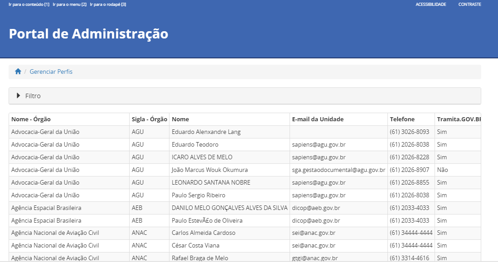
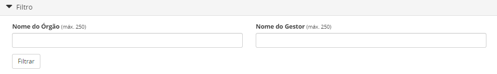
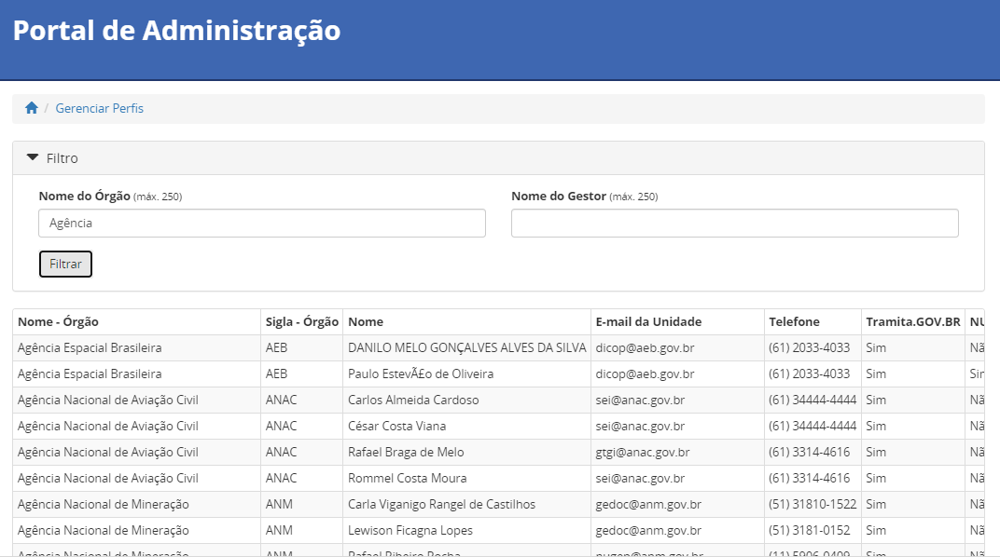

2023.10.30-Procurar gestores no Portal do Tramita-V1
========================================================

Situação  
~~~~~~~~

Usuário deseja o contato do gestor do órgão X.

Quando Ocorre
~~~~~~~~~~~~~~

Quando o técnico recebe um chamado no portal que precisa orientar o usuário a coletar o contato do gestor do tramita do órgão x 

Solução Sugerida
~~~~~~~~~~~~~~~~

Enviar o `link <https://gestaopen.processoeletronico.gov.br/>`_ e informar ao usuário como consultar : 

1º. Ao abrir a página inicial existe uma barra lateral nominada “DETALHES”, clicar no 4º item: “**Dados dos Gestores do Tramita.GOV.Br e NUP**”.

.. figure:: _static/images/Dados_dos_Gestores_do_Tramita.GOV.Br_e_NUP.png

2º. Ao abrir a página “**Dados dos Gestores do Tramita.GOV.Br e NUP**” abrirá uma tela com uma lista de todos os órgãos cadastrados e os dados de contato de seus respectivos gestores. 

3º. Clicar seta (|play|)  do  “ Filtro”  e aparecerá a seguinte tela : 

Onde o usuário poderá pesquisar por meio do filtro “Nome do Órgão” ou “Nome do Gestor” os dados do gestor cadastrado no portal. 

.. |play| image:: _static/images/icone_play.png
   :align: middle
   :width: 20

Modelo de Resposta para Chamados  
~~~~~~~~~~~~~~~~~~~~~~~~~~~~~~~~

Prezado Senhor(a) [nome do usuário], 

  

Informamos que para ter acesso ao contato dos gestores, será necessário acessar o link : https://gestaopen.processoeletronico.gov.br/  e seguir os seguintes passos abaixo:  

1º. Ao abrir a página inicial existe uma barra lateral nominada “DETALHES”, clicar no 4º item: “**Dados dos Gestores do Tramita.GOV.Br e NUP**”. 

.. figure:: _static/images/Dados_dos_Gestores_do_Tramita.GOV.Br_e_NUP.png

2º. Ao abrir a página “**Dados dos Gestores do Tramita.GOV.Br e NUP**” abrirá uma tela com uma lista de todos os órgãos cadastrados e os dados de contato de seus respectivos gestores. 

3º. Clicar seta (|play|)  do  “ Filtro”  e aparecerá a seguinte tela : 

.. |play| image:: _static/images/icone_play.png
   :align: middle
   :width: 20

Onde o usuário poderá pesquisar por meio do filtro “Nome do Órgão” ou “ Nome do Gestor” os dados do gestor cadastrado no portal. 

Para saber mais sobre as ações do PEN, acesse gov.br/pen

Atenciosamente, 

[nome profissional do atendente]” 

Atribuições e responsabilidades  
~~~~~~~~~~~~~~~~~~~~~~~~~~~~~~~~

Nível 1, caso tenha mais dúvidas que fuja de responsabilidade subir para o nível 2.

Perfil do usuário  
~~~~~~~~~~~~~~~~~~

Caráter negocial.

Palavras-chave  
~~~~~~~~~~~~~~

Gestor de Protocolo, Tramita.GOV.BR, Portal de Administração.

Referências  
~~~~~~~~~~~~

`FAQ do Tramita GOV.BR <https://www.gov.br/economia/pt-br/assuntos/processo-eletronico-nacional/destaques/faq/tramita-gov.br>`_.  

`Portal Processo Eletrônico <https://gestaopen.processoeletronico.gov.br/>`_ 